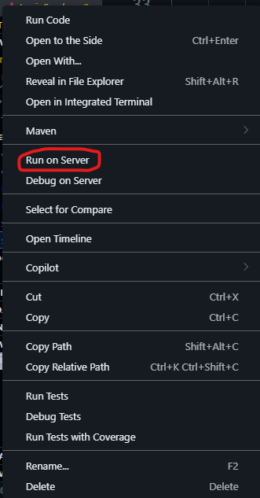
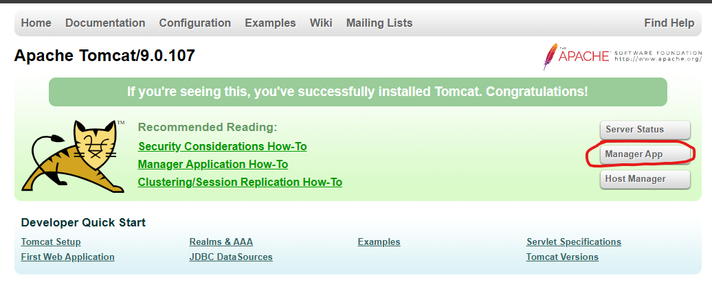
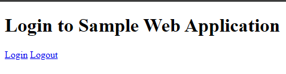

# 🚀 Java Servlet Development Environment Setup Guide

## 📋 Prerequisites & Downloads

Before we begin, make sure you have the following items ready:

### 🔧 Required Downloads

| Component | Download Link | Description |
|-----------|---------------|-------------|
| **Apache Tomcat 9** | [apache-tomcat-9.0.107-windows-x64.zip](https://dlcdn.apache.org/tomcat/tomcat-9/v9.0.107/bin/apache-tomcat-9.0.107-windows-x64.zip) | Web server for running servlets |
| **Maven Daemon** | [maven-mvnd-1.0.2-windows-amd64.zip](https://dlcdn.apache.org/maven/mvnd/1.0.2/maven-mvnd-1.0.2-windows-amd64.zip) | Fast Maven build tool |
| **ServletDemo Project** | `ServletDemo.zip` | Your project files |

### 🔌 VS Code Extensions

Install these essential extensions in Visual Studio Code:

1. **Java Extension Pack**
   - Extension ID: `vscjava.vscode-java-pack`
   - Provides comprehensive Java development support

2. **Community Server Connector**
   - Extension ID: `redhat.vscode-community-server-connector`
   - Enables server management within VS Code

---

## 🛠️ Step 1: Installation & Environment Setup

### 📁 Extract Files

1. **Extract Apache Tomcat to C:\ drive**
   ```
   📂 C:\apache-tomcat-9.0.107\
   ```


2. **Extract Maven Daemon**
   ```
   📂 C:\maven-mvnd-1.0.2\
   ```

3. **Extract ServletDemo Project**
   - Download from: [ServletDemo.zip](ServletDemo.zip)
   
   Extract this whenever you want to access your project

### 🌍 Environment Variables Setup

Add the following paths to your system's **PATH** environment variable:

```batch
C:\apache-tomcat-9.0.107\bin
C:\maven-mvnd-1.0.2\bin
```

#### 💡 How to Add to PATH:
1. Search **Environment Variables** in the Windows search bar
2. Click **Edit the system environment variables**
3. Click **Environment Variables** button
4. Under **System variables**, select **Path** → **Edit**
5. Under **User variables**, select **Path** → **Edit**
6. Click **New** and add each path for both system and user variables
7. Click **OK** to save changes

---

## 📝 Step 2: Project Setup in VS Code

### 🚀 Open Project
1. Launch **Visual Studio Code**
2. Open the extracted `ServletDemo` folder
3. Ensure all required extensions are installed and active

### ✅ Verify Installation (Optional)
Test your Maven Daemon installation:

```bash  
mvnd -v
```

**Expected Output:** Version information for Maven Daemon

---

## 🔨 Step 3: Build & Deploy

### 🏗️ Build the Project

Run the following command in VS Code terminal:

```bash
mvnd clean install
```

**This command will:**
- Clean previous builds
- Compile your Java code
- Generate a WAR file for deployment

### 🖥️ Deploy to Server

1. **Locate the WAR file** in your project's `target` directory
2. **Right-click** on the WAR file
3. Select **"Run in Server"** from the context menu



### 🔧 Configure Apache Tomcat Server

When prompted to add a server:

1. **Choose "No, use server on disk"** when asked about downloading server
2. Navigate to the **server folder** in VS Code
3. **Right-click** on your Tomcat server and select **"Start Server"**
4. Point to your installation: `C:\apache-tomcat-9.0.107`


---

## 🔄 Development Workflow

### ⚠️ Important: Update Process

**After ANY code changes, you MUST run:**

```bash
mvnd clean install
```

This ensures your WAR file is updated with the latest changes.

---

## 🌐 Testing Your Application

### 🎯 Access Your Application

1. **Open your browser**
2. **Navigate to:** `http://localhost:8080`
3. **Click on:** "Manager App" (you may need to sign in with username: `admin`)
4. **Username = admin and password = admin**




4. **Locate your application:** Look for `/simplewebapp` in the Applications table
5. **Click on:** `/simplewebapp` link to access your application


### 🎉 Success!

You should see your servlet application running with the login page:



**🎊 Congratulations! Your development environment is ready and your application is live!**

---

## 🚨 Troubleshooting

### Common Issues & Solutions

| Issue | Solution |
|-------|----------|
| **Command not found** | Verify PATH environment variables |
| **Port 8080 in use** | Stop other services using port 8080 |
| **WAR file not found** | Ensure `mvnd clean install` completed successfully |
| **Server won't start** | Check Tomcat logs in `logs` directory |

### 📞 Quick Commands Reference

```bash
# Test Maven Daemon
mvnd -v

# Build project
mvnd clean install

# Check Java version
java -version
```

---

## 🎊 Completion Checklist

- [ ] Downloaded all required files
- [ ] Extracted files to C:\ drive
- [ ] Set up environment variables
- [ ] Installed VS Code extensions
- [ ] Opened ServletDemo in VS Code
- [ ] Successfully built project with `mvnd clean install`
- [ ] Deployed WAR file to Tomcat server
- [ ] Accessed application at `localhost:8080/simplewebapp`

---

## 🎯 Quick Start Summary

```bash
# 1. Download & extract files to C:\
# 2. Add bin paths to PATH environment variable
# 3. Open ServletDemo in VS Code
# 4. Build project
mvnd clean install
# 5. Deploy WAR file to server
# 6. Access at localhost:8080/simplewebapp
```

**🎉 Boom!! Your setup is complete and ready for development!**

---

*Happy coding! 💻✨*